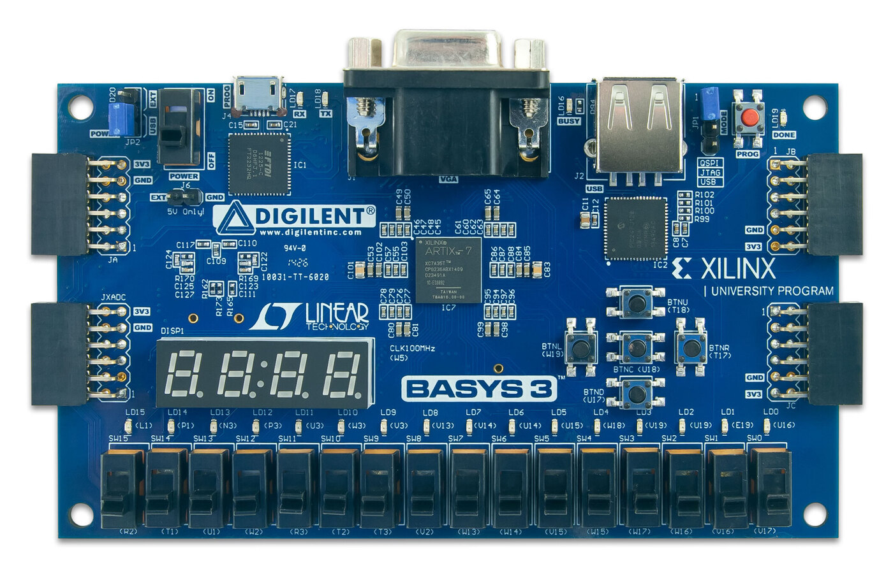

# FPGA Circuit Designs

**Hardware implementations for basic digital circuit designs applied to a [Digilent Basys 3](https://digilent.com/reference/programmable-logic/basys-3/start) development board with a [Xilinx Artix-7](https://www.amd.com/en/products/adaptive-socs-and-fpgas/fpga/artix-7.html) FPGA chip.**

These circuit designs are written in the [Verilog](https://en.wikipedia.org/wiki/Verilog) hardware description language, using the [Vivado Design Suite](https://www.amd.com/en/products/software/adaptive-socs-and-fpgas/vivado.html).

---

<p>
  <sup>
    <b>Contents</b>:
    <a href="#preamble-for-beginners">Preamble for beginners</a> ·
    <a href="#what-is-an-fpga">What is an FPGA?</a> ·
    <a href="#steps-to-create-and-implement-hardware-designs-on-an-fpga">Steps to create and implement hardware designs on an FPGA</a> ·
    <a href="#circuits">Circuits</a>
  </sup>
</p>

## Preamble for beginners

I began this project as part of my exporation into FPGAs coming from a software engineering background with limited hardware and electrical engineering knowledge, and hope that it can be useful for other beginners.

If you do not have a background in digital design or hardware, I suggest at least partially reading [*Digital Design and Computer Architecture*](https://pages.hmc.edu/harris/ddca/ddca2e.html) by David Harris &amp; Sarah L. Harris before getting started with FPGA development. The book provides a good foundation and is written very well, 
easy to follow and has a lot of follow-up exercises to test your knowledge.

If you want to follow along and try implementing some of the circuits, here are some suggestions:

- Implement circuit designs in the order they are mentioned in this README.
- If you don't have a development board yet, it is still possible to start with module design and simulation.
- If you do have a board, always try out your modules on hardware — simulations aren't always the truth!
- Other development boards should be fine as long as they have similar I/O to the Basys 3.
- There is no need to stick to Verilog, feel free to try other HDLs.
- Make sure to write a testbench or multiple for each module.
- Compare your module designs with mine, but don't take them as gospel — I'm a learner too!
- Feel free to create an issue to suggest new circuit designs that are suitable for beginners.

## What is an FPGA?

A [**field-programmable gate array (FPGA)**](https://en.wikipedia.org/wiki/Field-programmable_gate_array) is a reprogrammable integrated circuit consisting of:

- **look-up tables (LUTs)** that can be programmed to implement any combinationial logic function,
- **routing architecture (fabric)** that can be programmed to connect logic blocks (comprising LUTs) to I/O blocks.
With this flexibility FPGAs can be programmed to implement arbitrary hardware devices through the use of a hardware description language (HDL) such as Verilog.

For example, FPGAs can be used to implement:

- low-latency network interfaces for receiving, manipulating and sending packets over different protocols,
- video and image processors for applying transformations such as filtering and compression,
- optimized inference pipelines for trained machine learning models,
- and even microprocessors fully implemented in digital logic (called *soft microprocessors*).

FPGAs are typically integrated into development boards such as the Digilent Basys 3 which consists of a Xilinx Artix-7 FPGA chip. Development boards provide:

- I/O interfaces for peripherals such as push buttons, toggle switches, LEDs, seven-segment displays, 
- ports for ethernet, VGA, HDMI, USB and PMOD connections,
- on-board block RAM, digital signal processing cores and sometimes even CPU cores.

<p align="center">
	<br/>
	<em>Digilent Basys 3 development board with a Xilinx Artix-7 FPGA chip (in the centre).</em><br/>
	<sup>Image courtesy of Digilent (from the <a href="https://digilent.com/reference/programmable-logic/basys-3/reference-manual">Basys 3 reference manual</a>).</sup>
</p>

## Steps to create and implement hardware designs on an FPGA

Despite some similarities, hardware design and implementation of digital circuits on an FPGA has a very different approach and process to software development.

### 1. Module design

Digital circuits are designed at this stage through the use of a HDL such as Verilog or VHDL.
Most computer-aided design (CAD) tools such as Vivado can produce a schematic of the 
module for visual inspection.

**Example**: Verilog module design and corresponding schematic for a single digit seven-segment display.

```verilog
`timescale 1ns / 1ps

module SevenSegmentDisplay(
    input wire [3:0] value,
    // Input value (0-15)
    input wire decimal,
    // Decimal/hexadecimal mode selector 
    input wire [1:0] digit,
    // Digit selector (0-3)
    output reg [3:0] anodes,
    // Inverted one-hot digit indicator
    output reg [7:0] cathodes
    // Inverted one-hot segment indicator
);
    // Output bus
    wire [7:0] segments;

    // Use an external module for decoding the input
    SevenSegmentDecoder Decoder (.value(value), .decimal(decimal), .segments(segments));
    
    always @(*) begin
        // Drive anodes - convert to inverted one-hot encoding
        case (digit)
            2'b00: anodes = ~4'b0001;
            2'b01: anodes = ~4'b0010;
            2'b10: anodes = ~4'b0100;
            2'b11: anodes = ~4'b1000;
        endcase
        
        // Drive cathodes
        cathodes = segments;
    end
endmodule
```

<p align="center">
    
</p>

### 2. Behavioural simulation

Before designed modules are synthesized, implemented and programmed into an FPGA,
behavioural simulation lets us inspect a circuit design by building a *testbench* which 
accepts test input signals and allows us to compare expected outputs
against simulated outputs through the use of *timing diagrams*.

Behavioural simulation is analogous to writing unit tests for a modular software package, 
but for hardware.

**Example**: Simulation test bench and corresponding timing diagram for the seven-segment display module.

```verilog
`timescale 1ns / 1ps

module TestSevenSegmentDisplay();
    reg [3:0] value;
    reg decimal;
    reg [1:0] digit;
    wire [3:0] anodes;
    wire [7:0] cathodes;
    
    // Indicate module as circuit-under-test (CUT)
    SevenSegmentDisplay CUT (value, decimal, digit, anodes, cathodes);
    
    integer i;
    integer j;
    integer k;
    
    initial begin
        /* Iterate through all input combinations:
         * decimal: 0/1 (decimal/hexadecimal mode selector)
         * digit: 0-3 (anode selector)
         * value: 0-15 (numerical value input)
         */
        for (i = 0; i < 2; i = i + 1) begin
            decimal = i;
            for (j = 0; j < 4; j = j + 1) begin
                digit = j;
                for (k = 0; k < 16; k = k + 1) begin
                    value = k;
                    #5; // Wait 5 nanoseconds after setting the value
                end
            end
        end
        $stop;                  
    end
endmodule
```


### 3. Synthesis

Once tested through simulation, a circuit design can then be synthesized by mapping 
high level HDL code into the available hardware resources of the FPGA, called *primitives*. In other words,
synthesis converts (or *elaborates*) a circuit schematic into an FPGA *netlist*.

### 4. Implementation

With the produced netlist from synthesis, implementation is the process of translating the described primitives
into the specific programmable logic blocks (*placement*) and fabric (*routing*) physically available on the FPGA.
CAD tools often provide a visualization that shows pin connections on the FPGA chip.

**Example**: Placement and routing for the seven-segment display module. Each circle is a pin on the FPGA.

<p align="center">
    
</p>

### 5. Bitstream generation

The final step of development is to generate a *bitstream*, which is a complete description of the 
logic and routing necessary to implement the design on hardware. Bitstreams are typically vendor-specific, 
meaning that each tool for FPGA development (e.g. Vivado) has a unique format and proprietary set 
of instructions for producing and representing bitstreams for hardware programming on supported FPGAs.

### 6. Hardware programming

With a produced bitstream, the development board can be connected and the FPGA 
configured by pushing the bitstream to the device.

## Circuits

Below are a selection of introductory circuits that are useful for learning basic FPGA development.

Each circuit has its own project folder and set of subdirectories for project files:
- `modules/`: Verilog design for the main module and any related modules used within the circuit.
- `simulations/`: Simulation testbenches for behavioural testing of the module.
- `constraints/`: XDC/TCL constraint files for placement and routing.

Each circuit has more information on its own linked `README.md`, giving a high level description of the module as well as its expected inputs and outputs.

### Combinational logic circuits

Combinational logic circuits are time-independent, meaning that the output is purely a function of the current inputs.
These circuits are also described as memoryless or stateless, as they do not need to maintain any knowledge of past outputs.

Combinational logic circuits are typically much simpler to program as timing and state is less of a concern during development and testing.

- [x] [LED - Switch-powered](/projects/combinational/1-led-switch/)
- [x] [LED - Switch-powered with AND gate](/projects/combinational/2-led-switch-and/)
- [x] [Seven-segment display discoder](/projects/combinational/3-seven-segment-decoder/)
- [x] [One-digit seven-segment display](/projects/combinational/4-one-digit-seven-segment-display/)
- [ ] [Four-digit seven-segment display](/projects/combinational/5-four-digit-seven-segment-display/)
- [ ] Full adder with seven-segment display
- [ ] Arithmetic logic unit
- [ ] Arithmetic logic unit with seven-segment display

### Sequential logic circuits

Sequential logic circuits are circuits whose output is a function of their inputs, as well as past outputs. 
Due to the dependence on past outputs, sequential logic circuits require memory which is typically implemented
in the form of *flip-flips* for *synchronous* circuits (synchronized with a clock signal).

Sequential logic circuits are usually synchronous for predictability and ease of design and testing, 
though may be *asynchronous* in certain cases.

- [ ] LED - Button-powered (stateful)
- [ ] Counter - Button-powered with fixed increment
- [ ] Counter - Button-powered with fixed increment/decrement
- [ ] Counter - Button-powered with variable increment/decrement
- [ ] LED pulser - Button-powered with clocked shift register (fixed frequency)
- [ ] LED pulser - Button-powered with clocked shift register (variable frequency)
- [ ] Counter - Button-powered with LED-triggered divide-by-3 state machine
- [ ] Counter - Button-powered with LED-triggered divide-by-n state machine
- [ ] Register file / SRAM 

---

<p align="center">
  &copy; 2024-2026, Edwin Onuonga - Released under the <a href="https://opensource.org/licenses/MIT">MIT</a> license.<br/>
  <em>Authored and maintained by Edwin Onuonga.</em>
</p>
