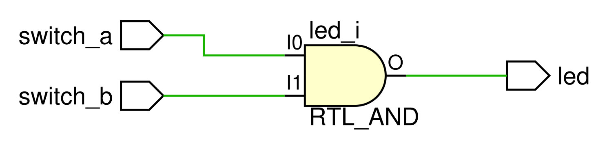

# LED - Switch-powered with AND-gate

This module should implement a basic switch-powered LED connection that: 

- illuminates an LED on the development board only when both switches are turned on simultaneously, 
- disables the LED when both of the switches are not turned on simultaneously.

    <b>Click here to view the schematic diagram for this circuit's module implementation</b>

     
    

## Inputs

- `switch_a`: 1-bit input representing the state of the first switch.
  - Should be controlled by a single toggle switch.

- `switch_b`: 1-bit input representing the state of the second switch.
  - Should be controlled by a single toggle switch.

## Outputs

- `led`: 1-bit output representing the state of the LED.
