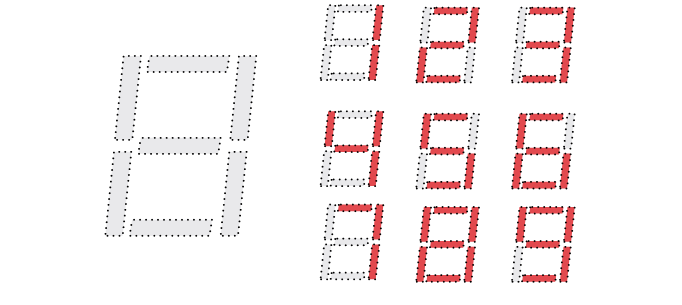
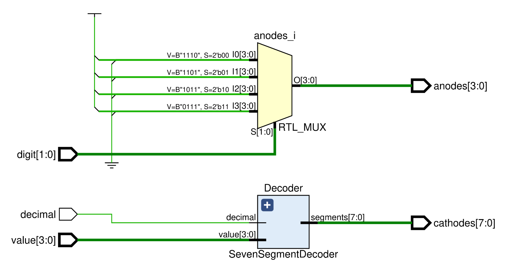

# LED - One-digit seven-segment display 

This module should reuse the [seven-segment display decoder module](../3-seven-segment-decoder/) implemented previously to allow for a value to be displayed on the development board by using toggle switches for input control. 

<blockquote>

A seven-segment display is a form of output that can be used to display simple glyphs that can be constructed from seven linear segments. They are commonly used to show numerical values in the form of decimal or hexadecimal digits.

    

A seven-segment display decoder should accept a numerical value as input, and decode the value into seven output signals indicating which segments must be simultaneously illuminated in order to render that value on the display.

</blockquote>

Synthesis and implementation should be done to connect the FPGA I/O pins for the on-board seven-segment display to the correct module outputs.

    <b>Click here to view the schematic diagram for this circuit's module implementation</b>

     
    

## Inputs

- `value`: 4-bit input representing the value to be displayed (0-15).
  - Should be controlled by four toggle switches.
- `decimal`: 1-bit input representing a decimal/hexadecimal mode selector.
  - Should be controlled by a single toggle switch.
  - When driven high, the display should be in decimal mode and show:
    - digits 0-9 if `value` is between 0-9, 
    - a hyphen (`-`) if `value` is between 10-15.
  - When driven low, the display should be in hexadecimal mode and show:
    - digits 0-9 if `value` is between 0-9,
    - letters A-F if `value` is between 10-15.
- `digit`: 2-bit input representing which of the four digits on the display to use.
  - Should be controlled by two toggle switches.

## Outputs

- `anodes`: 4-bit one-hot encoded output representing the digit to be used.
- `cathodes`: 7-bit output representing the segments to be illuminated.

## Comments

The Digilent Basys-3 has a four-digit seven-segment display which has:

- a single 4-bit common anode input to select a digit,
- seven 1-bit cathode inputs to illuminate each of the seven segments of the selected anode.

Both the anode and cathode values need to be driven low in order to select a digit and illuminate a segment.
