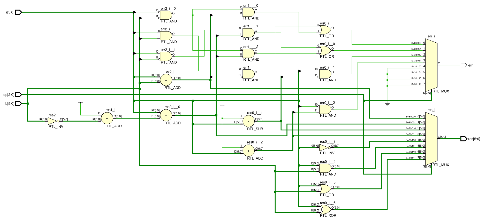

# Arithmetic logic unit with LED display

This module should implement a basic 6-bit ALU using built-in Verilog operators to implement the following functions:

1. Add (`A + B`)
2. Subtract (`A - B`)
3. Decrement (`A - 1`)
4. Increment (`A + 1`)
5. Bitwise NOT (`~A`)
6. Bitwise AND (`A & B`)
7. Bitwise OR (`A | B`)
8. Bitwise XOR (`A ^ B`)

Numbers should be represented using two's complement, and arithmetic should be implemented respecting this.

Operations should be done using basic in-built Verilog numerical and bitwise operators, ignoring the need to implement modules such as adders, or handling carry values.

The 6-bit output value should be rendered using the LEDs on the development board, in addition to a single LED for the error flag.

    <b>Click here to view the schematic diagram for this circuit's module implementation</b>

     
    

## Inputs

- `a`: 6-bit input representing the first integer input represented in two's complement.
  - Should be controlled by six slide switches.
- `b`: 6-bit input representing the first integer input represented in two's complement.
  - Should be controlled by six slide switches.
- `op`: 3-bit input representing the operation to be carried out on the ALU.
  - Should be controlled by three slide switches.

## Outputs

- `res`: 6-bit output value
  - Should be displayed using six LEDs.
- `err`: 1-bit error flag indicating overflow or underflow.
  - Should be displayed using one LED.
