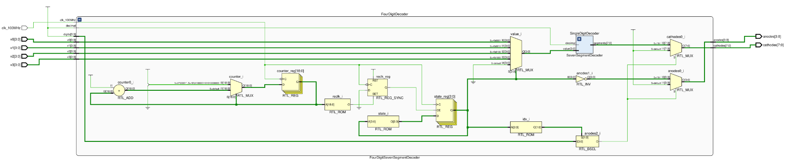

# Four-digit seven-segment display 

This module should reuse the [seven-segment display decoder module](../../combinational/3-seven-segment-decoder/) implemented previously to allow for a four-digit decimal number to be fully rendered on the on-board seven-segment display.

The decoder for this display should be implemented in a flexible way to allow for any combination of the four digits to be enabled/disabled.
The decoder should also have the option of displaying hexadecimal digits, although this will likely not be used.

    <b>Click here to view the schematic diagram for this circuit's module implementation</b>

     
    

## Inputs

- `clk_100MHz`: Input signal representing a 100MHz clock for synchronization.
  - Should be connected to the on-board oscillator pin.
- `v3`, `v2`, `v1`, `v0`: 4-bit inputs representing the value (0-9) to be displayed for each digit on the display.
  - Should be controlled by 16 slide switches.

## Outputs

- `anodes`: 4-bit one-hot encoded output representing the digit to be used.
- `cathodes`: 8-bit output representing the segments to be illuminated.

## Comments

The Digilent Basys-3 has a four-digit seven-segment display which has:

- a single 4-bit common anode input to select a digit,
- eight 1-bit cathode inputs to illuminate each of the seven segments of the selected anode.

Both the anode and cathode values need to be driven low in order to select a digit and illuminate a segment.
