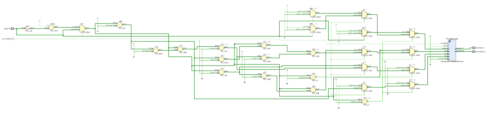

# Full seven-segment display

This module should reuse the decoder module from the [four-digit seven-segment display](../../sequential/1-four-digit-seven-segment-display/) implemented previously to allow for an arbitrary 8-bit number represented in two's complement (ranging from -128 to -127) to be fully rendered on the on-board seven-segment display.

This is the final seven-segment display module implemented in this project, and will be used in subsequent projects to display numerical values.

    <b>Click here to view the schematic diagram for this circuit's module implementation</b>

     
    

## Inputs

- `clk_100MHz`: Input signal representing a 100MHz clock for synchronization.
  - Should be connected to the on-board oscillator pin.
- `value`: 8-bit two's complement value to display.
  - Should be controlled by 8 slide switches.

## Outputs

- `anodes`: 4-bit one-hot encoded output representing the digit to be used.
- `cathodes`: 8-bit output representing the segments to be illuminated.

## Comments

The Digilent Basys-3 has a four-digit seven-segment display which has:

- a single 4-bit common anode input to select a digit,
- eight 1-bit cathode inputs to illuminate each of the seven segments of the selected anode.

Both the anode and cathode values need to be driven low in order to select a digit and illuminate a segment.
