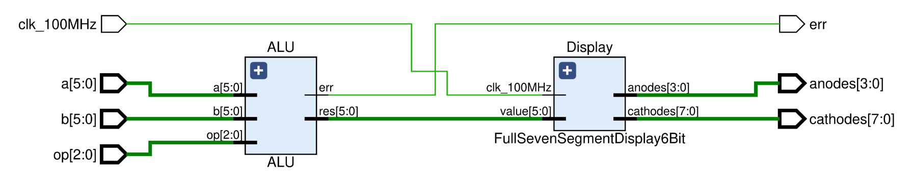

# ALU with seven-segment display

This module should reuse the previously implemented [6-bit ALU](../../combinational/5-arithmetic-logic-unit/) 
along with a modified version of the [full seven-segment display](../sequential/2-full-seven-segment-display/)
supporting 6-bit values, in order to allow the ALU outputs to be rendered on the on-board seven-segment display.

    <b>Click here to view the schematic diagram for this circuit's module implementation</b>

     
    

## Inputs

- `clk_100MHz`: Input signal representing a 100MHz clock for synchronization.
  - Should be connected to the on-board oscillator pin.
- `a`: 6-bit input representing the first integer input represented in two's complement.
  - Should be controlled by six slide switches.
- `b`: 6-bit input representing the first integer input represented in two's complement.
  - Should be controlled by six slide switches.
- `op`: 3-bit input representing the operation to be carried out on the ALU.
  - Should be controlled by three slide switches.

## Outputs

- `anodes`: 4-bit one-hot encoded output representing the digit to be used.
- `cathodes`: 8-bit output representing the segments to be illuminated.
- `err`: 1-bit error flag indicating overflow or underflow.
  - Should be displayed using one LED.

## Comments

The Digilent Basys-3 has a four-digit seven-segment display which has:

- a single 4-bit common anode input to select a digit,
- eight 1-bit cathode inputs to illuminate each of the seven segments of the selected anode.

Both the anode and cathode values need to be driven low in order to select a digit and illuminate a segment.
