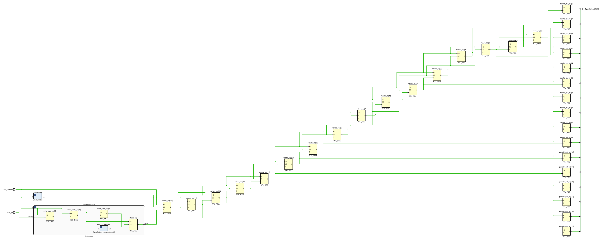

# Shift register - Button-powered LED display

This module should implement a 16-bit shift register with the serial input controlled by a single push button. The flip-flop outputs should be connected to the 16 LEDs on the board, and the clock signal should be divided down to a rate that makes the shifting viewable to the human eye, e.g. 2Hz or 4Hz.

As an extension, try to implement the clock divider as a separate module and parameterize bit-width of the shift register,
as well as the clock divider rate.

Note that as push buttons are a form of asynchronous input, metastability must be addressed and mitigated for example by using a series of cascading flip-flops. The input must also be debounced so that individual button presses are captured correctly.

    <b>Click here to view the schematic diagram for this circuit's module implementation</b>

     
    

## Inputs

- `clk_100MHz`: Input signal representing a 100MHz clock for synchronization.
  - Should be connected to the on-board oscillator pin.
- `serial_in`: Serial input for the shift register.
  - Should be controlled by a single slide switch.

## Outputs

- `parallel_out`: Parallel output values for all of the flip-flops.
