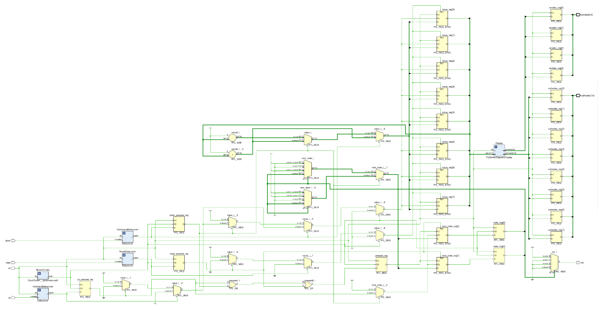

# Divide-by-3 counter - Button-powered with seven-segment display

This module should implement a divide-by-3 counter that is connected to an increment button and a decrement button, 
with the resulting value being rendered on a seven-segment display.

- A finite state machine should be used to determine divisibility by 3, rather than division/modulo operators.
- The counter should be resettable by pressing another reset button.
- Each button should only increase/decrease the value by 1.
- Similarly to other projects using buttons, the asynchronous nature of the button input should be handled accordingly by accounting for metastability and debouncing.
- Additional logic is needed for determining button press events.

    <b>Click here to view the schematic diagram for this circuit's module implementation</b>

     
    

## Inputs

- `clk_100MHz`: Input signal representing a 100MHz clock for synchronization.
  - Should be connected to the on-board oscillator pin.
- `up`: Input signal indicating an increment.
  - Should be connected to a push button.
- `down`: Input signal indicating a decrement.
  - Should be connected to a push button.
- `reset`: Input signal indicating a counter reset (to zero).
  - Should be connected to a push button.
- `amount`: 4-bit quantity to increment/decrement by.
  - Should be connected to four slide switches.

## Outputs

- `div`: 1-bit output indicating whether the currently displayed value is divisible by 3.
  - Should be represented by an LED.
- `anodes`: 4-bit one-hot encoded output representing the digit to be used.
- `cathodes`: 8-bit output representing the segments to be illuminated.
